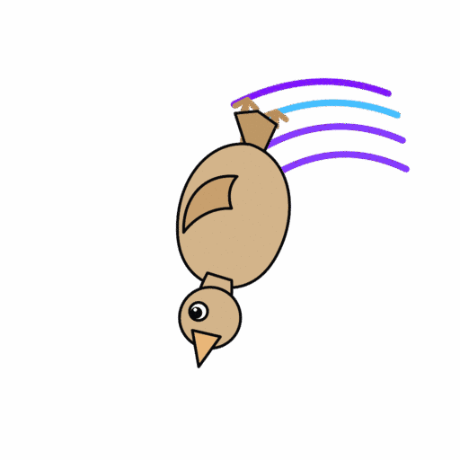

<!--
N.B.: This README is normally auto-generated by <https://github.com/YunoHost/apps_tools/blob/main/readme_generator>
once this package is added to the YunoHost apps catalog. It should be regenerated then rather than edited by hand.
-->

<h1>
  
  Nostr Clips, packaged for YunoHost
</h1>

Consumption-first, TikTok-style vertical short-form video client for Nostr

[](https://github.com/imattau/scrollstr)
[?style=for-the-badge)]()

## 📦 Developer info

🛠️ Upstream repository (project name: scrollstr): <https://github.com/imattau/scrollstr>

This package is not yet submitted to the official YunoHost apps catalog.

Pull requests should target the `testing` branch. The `testing` branch can be
tested using:

```bash
# fresh install:
sudo yunohost app install https://github.com/imattau/nostrclips_ynh/tree/testing

# upgrade an existing install:
sudo yunohost app upgrade nostrclips -u https://github.com/imattau/nostrclips_ynh/tree/testing
```

### 📚 App packaging documentation

Please see <https://doc.yunohost.org/dev/packaging/> for more information.
